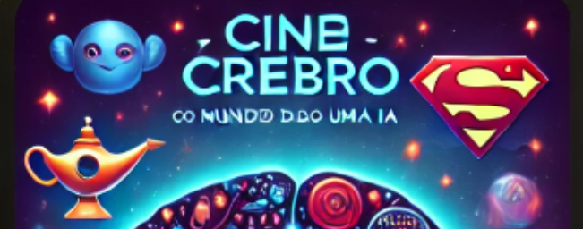

# Projeto EBOOK Gerado por I.A.s

Projeto com o objetivo de gerar um ebook digital com as facilidades das ferramentas de IA. Todos os prompts
seguem abaixo.

<a href="https://github.com/I-Andrade/dio-prompts-recipe-to-create-a-ebook/blob/main/output/E-book%20-%20Cinec%C3%A9rebro%20-%20O%20mundo%20nerd%20contado%20pela%20mente%20de%20uma%20IA.pdf" title="View PDF now"> 📕Clique aqui para ler</a>

## 💻 Tecnologias utilizadas no projeto

- [ChatGPT](https://chat.openai.com/) 
- [GoogleDocuments](https://docs.google.com/)

## 🧠 Prompts

ChatGPT：

|   Ação   | prompt                                                                                                                                                                                                                                                                         |
| :------: | ------------------------------------------------------------------------------------------------------------------------------------------------------------------------------------------------------------------------------------------------------------------------------ |
|  conteudo  | Você é um roteirista de e-book, e vamos criar um ebook com resumos de filmes, focado no mundo nerd, e apresentado de forma engraçada, cujo o nome é "Cinecérebro", subtítulo é ""O mundo nerd contado pela mente de uma IA."" e tem foco em filmes da cultura nerd, com o público alvo de pessoas sem tempo de assistir filmes. o formato do roteiro deve ser [INTRODUÇÃO] [CURIOSIDADE 1] [CURIOSIDADE 2] para os [filme]: Alladin, Vingadores, Homem Aranha, Star Wars, Matrix. {REGRAS} - no bloco [INTRODUÇÃO] substitua por uma introdução que sempre irá vincular o nome e subtítulo do podcast com o [filme] que será resumido. - no bloco [CURIOSIDADE 1] substitua por engraçada descrição sobre ano de lançamento, o valor convertido em reais da bilheteria alcançada por aquele [filme] e comentando sobre a nota do [filme] no IMDb, https://www.imdb.com/ , (ou outra fonte de dados acessível) - no bloco [CURIOSIDADE 2] substitua pelo resumo do [filme] citando os principais personagens. - Cada resumo vai ser apresentado pelo personagem mais engraçado daquele [filme]. - O roteiro deve sempre apresentar qualquer número, escrito por extenso em língua portuguesa do Brasil. - Gerar uma imagem de capa para o e-book - Gerar uma imagem de capítulo para cada resumo que tenha a ver com cada [filme] resumido, criando imagens genéricas mas alinhadas ao [filme] ou ao narrador do resumo do [filme]. - Gerar um índice e uma página de agradecimento, com imagem, e informando que o conteúdo foi criado por IA e montado por humano. {REGRAS NEGATIVAS} - Não use muitos termos técnicos.

## ✨ Features

- Conteúdo gerado via ChatGPT
- Imagens gerado via ChatGPT
- E-book construido via Google Documents

## 📚 Materiais

- ebook gerado em `output`

## 👨‍💻 Expert

I.Andrade

---

⌨️ com 💜 por [Felipe Aguiar](https://github.com/felipeAguiarCode)
